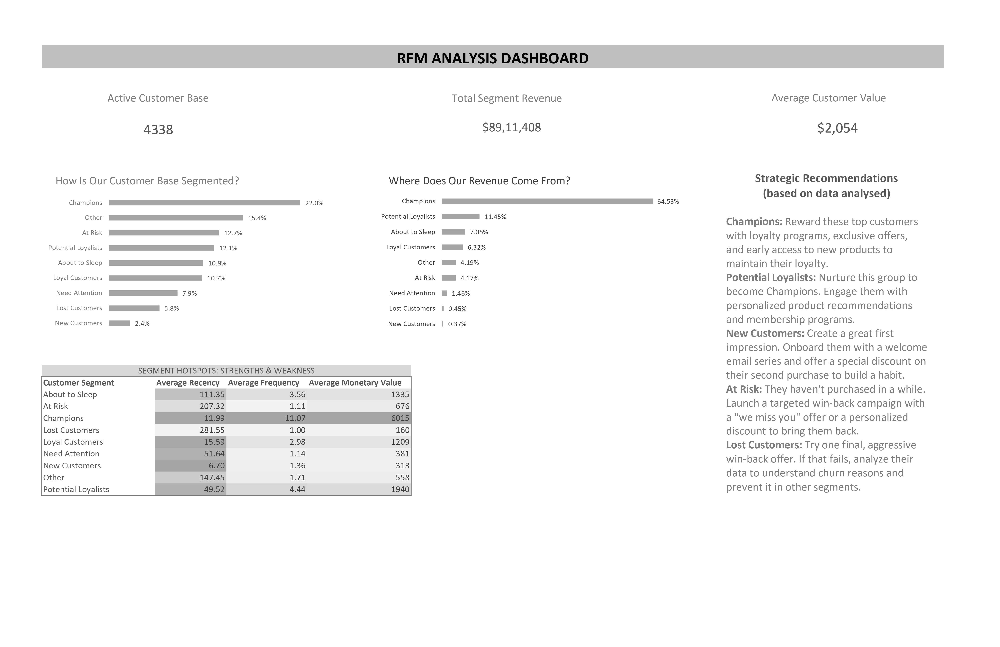

# RFM Analysis: Online Retail Dataset


*Sample dashboard generated in Excel (see `Analysis Dashboard.jpg`)*

## Project Overview

This project demonstrates a complete RFM (Recency, Frequency, Monetary) analysis workflow using the UCI Online Retail dataset. The process covers all major phases of the data analysis lifecycle, from data acquisition to business insights via dashboarding.

---

## Data Analysis Lifecycle in This Project

### 1. Data Acquisition
- **Source:** [UCI Machine Learning Repository – Online Retail Dataset](https://archive.ics.uci.edu/ml/datasets/online+retail)
- **File:** `Dataset/Online Retail.xlsx`

### 2. Data Import & Exploration
- **Importing data into SQL:**
	```sql
	CREATE TABLE online_retail (
			invoice_no VARCHAR(20),
			stock_code VARCHAR(20),
			description VARCHAR(255),
			quantity INT,
			invoice_date TIMESTAMP,
			unit_price NUMERIC(10, 2),
			customer_id INT,
			country VARCHAR(50)
	);
	COPY online_retail FROM 'D:/Online Retail.csv' WITH (FORMAT CSV, HEADER);
	```
- **Exploratory queries:**
	```sql
	-- Total rows
	SELECT COUNT(*) FROM online_retail;
	-- Date range
	SELECT MIN(invoice_date), MAX(invoice_date) FROM online_retail;
	-- Unique customers
	SELECT COUNT(DISTINCT customer_id) FROM online_retail;
	```

### 3. Data Cleaning
- **Remove nulls and invalid values:**
	```sql
	DELETE FROM online_retail WHERE customer_id IS NULL;
	DELETE FROM online_retail WHERE quantity <= 0;
	DELETE FROM online_retail WHERE unit_price <= 0;
	```

### 4. Feature Engineering & RFM Calculation
- **RFM Analysis SQL:**
	```sql
	WITH max_date AS (
			SELECT MAX(CAST(invoice_date AS DATE)) AS max_dt FROM online_retail
	),
	rfm_raw AS (
			SELECT
					customer_id,
					m.max_dt - MAX(CAST(o.invoice_date AS DATE)) AS recency,
					COUNT(DISTINCT o.invoice_no) AS frequency,
					SUM(o.quantity * o.unit_price) AS monetary_value
			FROM online_retail o
			CROSS JOIN max_date m
			WHERE o.quantity > 0
			GROUP BY customer_id, m.max_dt
	)
	SELECT * FROM rfm_raw;
	```
- **Customer Segmentation:** Customers are scored and segmented (e.g., Champions, Loyal Customers, At Risk, etc.) based on RFM scores.

### 5. Data Export
- **Processed data is exported as `Processed Data.csv` for further analysis and dashboarding.**

### 6. Dashboarding & Business Insights
- **Tool:** Excel
- **File:** `RFM Analysis.xlsx` (dashboard logic), `Analysis Dashboard.pdf` (exported dashboard)
- **Insights:** Visualizes customer segments, top customers, revenue trends, and actionable business recommendations.

---

## Repository Structure

- `Dataset/Online Retail.xlsx` – Raw data
- `processing_query.sql` – All SQL queries for cleaning, exploration, and RFM analysis
- `Processed Data.csv` – Cleaned and RFM-scored data
- `RFM Analysis.xlsx` – Excel dashboard logic
- `Analysis Dashboard.pdf` – Dashboard sample

---

## How to Reproduce

1. Download the dataset and place it in the `Dataset` folder.
2. Run the SQL scripts in [processing_query.sql](processing_query.sql) to clean and process the data.
3. Export the results to `Processed Data.csv`.
4. Open `RFM Analysis.xlsx` in Excel and refresh/import the processed data.
5. View or export the dashboard as PDF.

---

## Credits

- Dataset: [UCI Machine Learning Repository](https://archive.ics.uci.edu/ml/datasets/online+retail)

---
Feel free to fork, use, or extend this project!.
